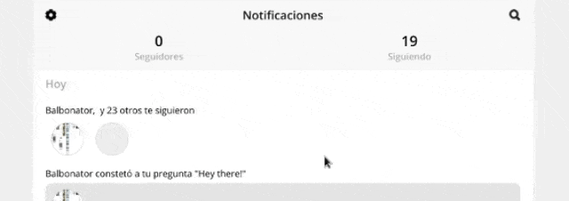

# react-native-web-refresh-control [](https://npmjs.com/package/react-native-web-refresh-control)

Drop-in RefreshControl component for web



## Installation and Configuration

```bash
npm i react-native-web-refresh-control
```

#### If you're using Expo
You can go ahead and use the package!

#### If you're NOT using Expo
You will need to configure webpack to parse JSX in `node_modules/react-native-web-refresh-control`.

1. Eject from `react-scripts` with `npm run eject`. Make sure to know what ejecting is before doing it.
2. Modify the main `babel-loader` module in `config/webpack.config.js`.
   * Replace `include: paths.appSrc,` with `include: [paths.appSrc, /node_modules\/react-native-web-refresh-control/],` 

## Usage

`react-native-web-refresh-control` exports two properties:

* `patchFlatListProps` is a function that you can call at some point, while your app is loading. It replaces the default value of the refreshControl prop of `FlatList`

* `RefreshControl` can be used to easily give `ScrollView` a pull-to-refresh functionality, just like the `RefreshControl` exported from react-native. However, if you used the `RefreshControl` from react-native, it would not work on the web. To see how to do this, check out this snack: https://snack.expo.io/@niciusb/refreshcontrol-example

## Example of RefreshControl

https://snack.expo.io/@niciusb/refreshcontrol-example

```
import { RefreshControl } from 'react-native-web-refresh-control'


<ScrollView
   refreshControl={
      <RefreshControl refreshing={refreshing} onRefresh={reloadLines} />
   }
>
   <Text>This scrollview will have pull-to-refresh functionality on the web</Text>
</ScrollView>
```

## Example of patchFlatListProps

```
// index.js
import { patchFlatListProps } from 'react-native-web-refresh-control'

import App from './App'

patchFlatListProps()
registerRootComponent(App)
```

## Customize flat list refresh control for web

* `patchFlatListProps` takes optional `options` to customize the refresh control:
* To customize refresh control for iOS and Android, please see [RefreshControl API](https://reactnative.dev/docs/refreshcontrol)

| option     | Type                | Description                                                                              | default                          |
|------------|---------------------|------------------------------------------------------------------------------------------|----------------------------------|
| colors     | array               | If tintColor is not defined, it uses the first color in the array for refresh indicator. |                                  |
| enabled    | boolean             | Whether the pull to refresh functionality is enabled.                                    | true                             |
| size       | RefreshControl.SIZE | Size of the refresh indicator.                                                           | RefreshLayoutConsts.SIZE.DEFAULT |
| tintColor  | color               | The color of the refresh indicator.                                                      |                                  |
| title      | string              | The title displayed under the refresh indicator.                                         |                                  |
| titleColor | color               | The color of the refresh indicator title.                                                |                                  |                 |                                  |

* Example
```
// index.js
import { patchFlatListProps } from 'react-native-web-refresh-control'

import App from './App'

// make refresh control red
patchFlatListProps({tintColor: 'red'})
registerRootComponent(App)
```
